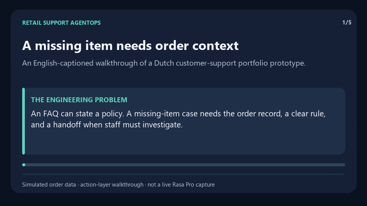
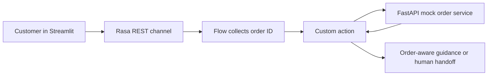

# Retail Support AgentOps

**A Rasa customer-support prototype that checks an example order before giving advice.** A customer can describe a missing item, damaged product, or partner-order problem; the assistant collects an order number, asks a local FastAPI service for structured order context, and recommends a human handoff when the case needs review.

[](https://github.com/QinnniQ/rasa-retail-support-agent/actions/workflows/tests.yml) 

This is an **independent portfolio prototype** using simulated orders and a Kruidvat-style interface. It is not an official Kruidvat, HEMA, AS Watson, or Rasa customer deployment. It does not create returns, issue refunds, access real customer records, or demonstrate a measured reduction in support load.

## 30-second engineering walkthrough



[Open the MP4 version](https://github.com/QinnniQ/rasa-retail-support-agent/raw/refs/heads/main/assets/walkthrough.mp4). The walkthrough uses the simulated `KV-10482` order and describes the tested backend and custom-action path. This is an illustrated explanation, **not a recording of the licensed Rasa Pro conversation** or a live retailer system.

## The support problem

An FAQ bot can explain a returns policy, but a missing-item complaint needs order-specific facts. This prototype shows how to separate a conversational entry point from the backend decision path:



| Example order | Situation | What the action does |
| --- | --- | --- |
| `KV-10482` | Missing item | Shows delivery and item status; recommends staff review. |
| `KV-20991` | Damaged item | Advises keeping evidence and seeking staff assessment. |
| `KV-77830` | Partner item | Flags that partner returns may follow a different process. |

The code keeps these rules in `actions/actions.py` and example data in `mock_backend.py`. The action validates the `KV-12345` order-number shape before calling the backend, uses a five-second timeout, and gives a clear fallback when the backend is unavailable or an order is not found. The Streamlit interface is a demo front end, and `credentials.yml` enables the Rasa REST channel it calls.

## What is verified

GitHub Actions tests the mock API and custom-action behavior on Python 3.10 and 3.12. Tests cover the three example cases, missing orders, invalid order IDs, advice selection, and backend connection/timeout errors. The tests use local fakes and do not need a retailer system or a Rasa Pro license.

```bash
python -m pip install -r requirements-dev.txt
python -m pytest --cov=actions.actions --cov=mock_backend --cov-report=term-missing --cov-fail-under=80
```

This suite verifies the **backend and action layer**. It does not train the full Rasa Pro assistant or test a live multi-turn conversation. Rasa Inspector can show the flow and slot state when you run the full stack in a licensed Rasa Pro environment.

## Run the full demo

The repository's `requirements.txt` installs the mock API, action SDK, and Streamlit UI. Running the conversation flow also requires access to **Rasa Pro**, which is distributed separately under Rasa's terms. Use a Python and Rasa Pro version supported by your installation.

```powershell
python -m venv .venv
.\.venv\Scripts\Activate.ps1
python -m pip install -r requirements.txt
# Install Rasa Pro using the instructions for your licensed environment.
rasa train
```

Start four terminals from the repository root:

```powershell
python -m uvicorn mock_backend:app --port 8001
rasa run actions
rasa run --enable-api --port 5005
streamlit run app.py
```

Open the local Streamlit URL shown in the terminal. Try `Er ontbreekt een artikel in mijn bestelling` (“An item is missing from my order”), ask to check an order, then enter `KV-10482`. You can also inspect the backend directly at `http://localhost:8001/orders/KV-10482` without Rasa Pro.

## Project map

| File | Responsibility |
| --- | --- |
| `config.yml`, `domain.yml`, `data/` | Rasa configuration, intents, responses, and flow. |
| `credentials.yml`, `endpoints.yml` | REST channel and action-server connection. |
| `actions/actions.py` | Order lookup, deterministic advice, and failure handling. |
| `mock_backend.py` | Three simulated orders served by FastAPI. |
| `app.py` | Streamlit chat demo. |
| `assets/` | English-captioned walkthrough and preview assets. |
| `tests/` | Local API and action checks run in CI. |

**Author:** Nicholai Gay · conversational AI and backend integration.
